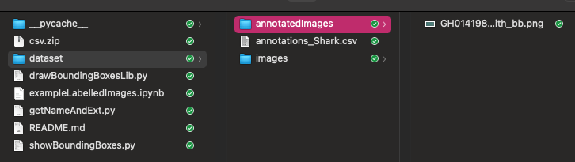

# From labels to bounding boxes

April 2022 - Version 1.01

.

_This toolbox provides different tools to annotate images. Maybe v2 will also allow image cropping._

## 1 - Global description

This toolbox main component is the library named `drawBoundingBoxLib.py`

All components are (see below for details)
- `drawBoundingBoxLib.py` -  The library itself
- `exampleLabelledImage.ipynb` - A Jupyter notebook to interactively see what can be done with the lib from Python
- `showBoundingBoxes.py` - A python-command-line program with arguments for you to 'drive' the library

## 2 - Image annotation in a nutshell

There are 2 really different ways of using the library, though the command-line python program showBoundingBoxes.
- You want to see an image with its corresponding bounding box
- You want to annotate (and save) a bunch of images coming from a CSV annotation file

Please note that the csv file must always be given, then, the choice between both modes is done by the input image (given or not)

### 2.1 - See annotation for a given image

To display the image on the screen:
```
python showBoundingBoxes.py --inputImage=<MY_IMAGE.JPG> --csv=<ANNOTATION_FILE.CSV> --show=Yes
```
To save the image with default file name, put as a png one:
```
python showBoundingBoxes.py --inputImage=<MY_IMAGE.JPG> --csv=<ANNOTATION_FILE.CSV> --write=Yes --png=Yes
```
### 2.2 - From a given annotation file, generate images with bounding boxes

To batch generate annotated images with bounding boxes:
```
python showBoundingBoxes.py -csv=<ANNOTATION_FILE.CSV> --inputFolder=<INPUT_FOLDER> --outputFolder=<OUTPUT_FOLDER> -w=Yes -p=Yes
```
Example:
```
python ../showBoundingBoxes.py -csv=annotations_Shark.csv -if=./images/ -of=./annotatedImages/ -w=yes
```
What it does
- Browses each line of the annotation file;
- For each line, look for the image in the given input folder;
- If exists, generate a new image with the corresponding bounding box in the given output folder.

## 3 - How to use __showBoundingBoxes.py__

___showBoundingBoxes___ has to be used in command-line mode. Entering `python showBoundingBoxes/py` AND providing arguments. In version 2.0 (to come) the only necessary argument will be the CSV file. Right now, you can only annotate one image at a time, thus, the input image name is also needed.

### 3.1 - Syntax
```
python showBoundingBoxes.py --help
usage: showBoundingBoxes.py [-h] [-ii INPUTIMAGE] [-oi OUTPUTIMAGE] -csv
                            CSVFILE [-if INPUTFOLDER] [-of OUTPUTFOLDER]
                            [-s SHOWIMAGE] [-w WRITEIMAGE] [-ap ABSOLUTEPATHS]
                            [-p SAVEASPNG] [-v VERBOSE]

optional arguments:
  -h, --help            show this help message and exit
  -ii INPUTIMAGE, --inputImage INPUTIMAGE
                        Input image filename
  -oi OUTPUTIMAGE, --outputImage OUTPUTIMAGE
                        Output image filename
  -csv CSVFILE          CSV file containing the annotations (shape: filename,
                        width, height, class, xmin, ymin, xmax, ymax)
  -if INPUTFOLDER, --inputFolder INPUTFOLDER
                        Input image filename
  -of OUTPUTFOLDER, --outputFolder OUTPUTFOLDER
                        Output image filename
  -s SHOWIMAGE, --show SHOWIMAGE
                        Show image?: Yes/No or True/False
  -w WRITEIMAGE, --write WRITEIMAGE
                        Write image (save as a new file): Yes/No or True/False
  -ap ABSOLUTEPATHS, --absolutePaths ABSOLUTEPATHS
                        Are image paths given in CSV file absolute and kept as
                        they are?: Yes/No or True/False
  -p SAVEASPNG, --png SAVEASPNG
                        If image is saved, PNG format will be used (better
                        quality): Yes/No or True/False
  -v VERBOSE, --verbosity VERBOSE
                        Verbose mode: Yes/No or True/False
```
### 3.2 - Typical use

```
pwd
/Users/olaf/_Documents/LoisirsNumeriques/Python/imageLabels

cd dataset/images 

python ../../showBoundingBoxes.py -ii=GH014198-60e7155540695_1399_0_760.jpeg -csv=../annotations_Shark.csv png=Yes -w=Yes 
```

### 3.3 - Better use

Please note that file name will be extracted from given parameter 'ii', and output image will be created in current folder. Thus if your hierarchy is



You can create an 'annotedImages' folder, move into it and enter

```
python ../../showBoundingBoxes.py -ii=../images/GH014198-60e7155540695_1399_0_760.jpeg -csv=../annotations_Shark.csv -w=Yes -p=Yes
``` 

### 3.4 - Check the result 

```
pwd
/Users/olaf/_Documents/LoisirsNumeriques/Python/imageLabels/dataset/annotatedImages

ls -l
total 1288
-rw-r--r--  1 olaf  staff  658610  3 avr 22:50 GH014198-60e7155540695_1399_0_760_with_bb.png 
```

## 4 - All 3 components detailled description

### 4.1 - ___drawBoundingBoxLib___ library

TBD

### 4.2 - The Jupyter notebook

TBD

### 4.3 - The command-line python program ___showBoundingBoxes___

TBD

